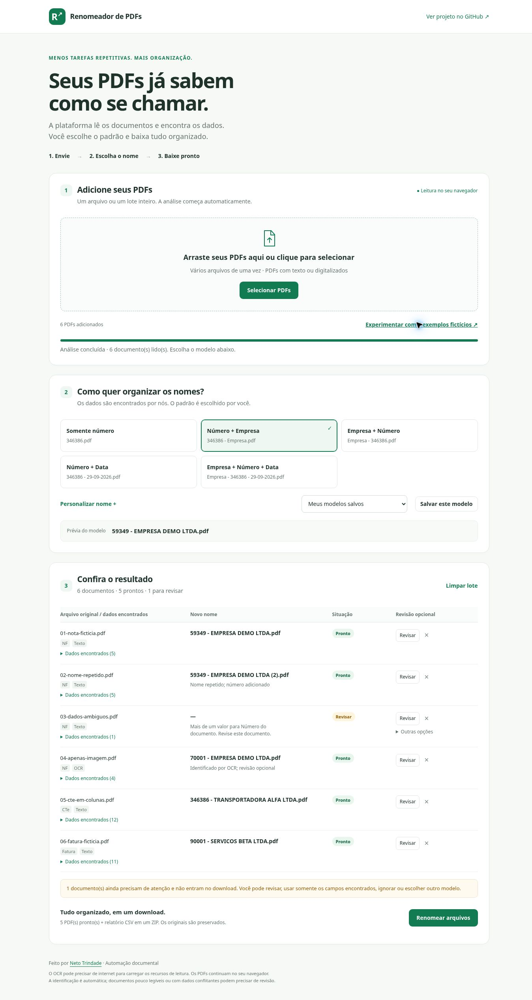

# Renomeador inteligente de PDFs

**Envie PDFs → leitura automática → escolha o padrão → baixe documentos organizados.**

Uma plataforma de automação documental de **[Neto Trindade](https://github.com/neto-trindade)**. O usuário escolhe **como** organizar o nome. A aplicação identifica **quais dados** existem no documento, sem exigir que cada PDF seja aberto ou preenchido manualmente.

**[Abrir a plataforma](https://neto-trindade.github.io/renomeador-pdf/)** · [Exemplos fictícios](examples) · [Validação](docs/VALIDACAO.md)



## Experimente

1. Arraste seus PDFs ou clique em **Selecionar PDFs**. Para testar sem documentos pessoais, use **Experimentar com 6 exemplos fictícios**.
2. A leitura de todas as páginas começa automaticamente. Em páginas digitalizadas, o OCR é acionado sem configuração.
3. Escolha um dos cinco modelos de nome ou clique em **Personalizar nome**.
4. Confira a prévia. Revisar dados é opcional, exceto quando um campo necessário estiver ausente ou ambíguo.
5. Clique em **Renomear arquivos** e depois em **Baixar arquivos**. Lotes geram `PDFs_Renomeados.zip`, com PDFs e relatório CSV. Um único arquivo pronto pode ser baixado diretamente como PDF.

Exemplo: o documento fictício em colunas tem CTe `346386`, emitente `TRANSPORTADORA ALFA LTDA` e uma NF referenciada `12345`. O modelo **Número + Empresa** gera `346386 - TRANSPORTADORA ALFA LTDA.pdf`, usando o número do transporte.

## O que funciona nesta versão

- Upload múltiplo, arrastar e soltar, processamento sequencial em lote.
- Extração do texto nativo e OCR local em português com Tesseract.js.
- Reconstrução de linhas e colunas a partir de posições **relativas**, sem coordenadas fixas por empresa.
- Identificação por títulos, rótulos, contexto de emitente/destinatário e chaves de acesso com dígito verificador.
- Números de NF, CTe, CE, fatura, pedido e documento; empresa, emitente, fornecedor, cliente, CNPJ/CPF, emissão, vencimento, valor, cidade/UF, descrição e código interno, quando encontrados.
- Novos campos no formato `Rótulo: valor` aparecem automaticamente na personalização, como **Centro de custo**.
- Cinco modelos prontos: número; número + empresa; empresa + número; número + data; empresa + número + data.
- Composição por partes, com campos e textos fixos em qualquer ordem: `NF [Número] - [Empresa]`, por exemplo.
- Modelos nomeados salvos neste navegador, reaproveitamento e exclusão.
- Dados encontrados por arquivo, prévia de nomes e correção de exceções.
- Campos ausentes não são inventados. É possível usar somente os encontrados, revisar, ignorar o documento ou mudar o padrão.
- Nomes repetidos recebem ` (2)`, ` (3)` etc., sem sobrescrever PDFs.
- Exportação preserva os bytes dos documentos; o OCR não altera o PDF original.
- O relatório registra nomes, campos extraídos, tipo, método de leitura e arquivos pendentes/ignorados.

## Identificação automática, com limites claros

Esta versão usa **extração por regras e OCR**, sem uma API generativa de IA. Ela encontra rótulos comuns e relações entre linhas/colunas, mas não compreende qualquer documento arbitrário. Campos sem rótulo, documentos pouco legíveis, empresas em seções não reconhecidas e layouts incomuns podem exigir revisão. Conflitos entre valores ficam pendentes; a aplicação não escolhe um valor arbitrariamente.

A detecção do tipo é uma sugestão contextual. CNPJ/CPF são extraídos pelo formato, sem validação cadastral ou fiscal. Datas inválidas são descartadas. Uma chave de acesso só é interpretada após validação estrutural e do dígito verificador; ela não fornece o dia de emissão. Números alfanuméricos de documento ainda podem não ser reconhecidos.

PDFs protegidos por senha não são lidos automaticamente. É possível usar uma cópia desbloqueada, ignorá-los ou informar um nome para essa exceção, preservando a proteção do original. Arquivos inválidos ficam fora do download. Documentos pendentes também não entram no ZIP e ficam registrados no relatório.

O lote fica em memória. O limite prático depende do tamanho dos PDFs, do número de páginas e do dispositivo; OCR de muitas páginas demanda tempo e memória. Foi testada a integridade de um lote de 100 PDFs pequenos, sem benchmark de grandes documentos digitalizados.

## Privacidade e execução local

Os PDFs e as imagens renderizadas são processados **no navegador**. Não há upload de documentos, conta, chave de API, telemetria ou backend. Apenas modelos de nome e suas preferências são salvos em `localStorage`; os PDFs e os campos dos documentos não são persistidos.

O OCR carrega o motor WebAssembly e o idioma português do jsDelivr, em versões fixadas. Essas requisições transferem recursos do motor de leitura, **não os documentos**. O primeiro uso pode precisar de internet; não há garantia de funcionamento offline do OCR. PDF.js, JSZip, cliente e worker do Tesseract estão incluídos em `vendor/`.

Para desenvolver, baixe ou clone o repositório e sirva a pasta por HTTP:

```sh
python -m http.server 8000
```

Abra `http://localhost:8000`. Também é possível usar hospedagem estática, como o GitHub Pages usado na demonstração. A abertura direta por `file://` não é recomendada para o worker de OCR.

## Arquitetura e evolução

| Módulo                        | Responsabilidade                                                              |
| ----------------------------- | ----------------------------------------------------------------------------- |
| `pdf-reader.js`               | PDF.js, páginas, texto e posições relativas; acionamento do leitor de imagens |
| `ocr.js`                      | Worker reutilizável de OCR, idioma e recursos do motor                        |
| `core.js`                     | Identificação de campos/tipos, evidências, modelos, nomes e colisões          |
| `archive.js`                  | ZIP, preservação do conteúdo e relatório CSV                                  |
| `app.js`                      | Fluxo de upload, análise, personalização, revisão e download                  |
| `index.html` / `style.css`    | Interface responsiva em português                                             |
| `samples.js` / `examples/`    | Seis documentos inteiramente fictícios                                        |
| `tests/`                      | Extração, exceções, integridade e lotes                                       |
| `scripts/generate_samples.py` | Geração reproduzível dos exemplos com ReportLab e Pillow                      |

O leitor entrega um documento estruturado com páginas e método de leitura; o extrator entrega valores, campos dinâmicos, candidatos e fontes; o montador de nomes só consome esses valores. Essa separação permite adicionar um provedor de análise com IA, novos leitores ou um backend sem tornar o preenchimento manual parte do fluxo principal.

Evoluções previstas: análise generativa com IA e evidências, modelos por tipo documental, histórico, pastas/categorias, armazenamento em nuvem, APIs e integrações empresariais. Esses recursos **não estão implementados** nesta versão.

## Testes

Node.js 20 ou superior, sem instalar dependências:

```sh
npm test
```

A suíte inclui PDFs com texto, colunas e várias páginas, papéis de empresas, dados ambíguos/ausentes, tipos documentais, campos dinâmicos, chaves de acesso, modelos, PDFs inválidos/protegidos, acionamento do adaptador OCR, ZIP/CSV e preservação dos bytes em 100 arquivos. A integração com o motor OCR e a interface hospedada são verificadas separadamente; veja [VALIDACAO.md](docs/VALIDACAO.md).

## Dependências

PDF.js 3.11.174, JSZip 3.10.1 e Tesseract.js/Core 7.0.0. O PDF.js mantém `isEvalSupported: false`, conforme a [orientação oficial para CVE-2024-4367](https://github.com/mozilla/pdf.js/security/advisories/GHSA-wgrm-67xf-hhpq). A aplicação não usa o viewer nem executa scripts embutidos nos PDFs. A atualização do PDF.js para módulos modernos permanece uma evolução técnica.

Licenças e recursos externos: [THIRD_PARTY_NOTICES.md](THIRD_PARTY_NOTICES.md).

Projeto preparado com apoio de IA no desenvolvimento. Exemplos fictícios, sem documentos de clientes. Demonstra automação de processos, JavaScript, OCR, extração documental, interface e testes de integridade.
